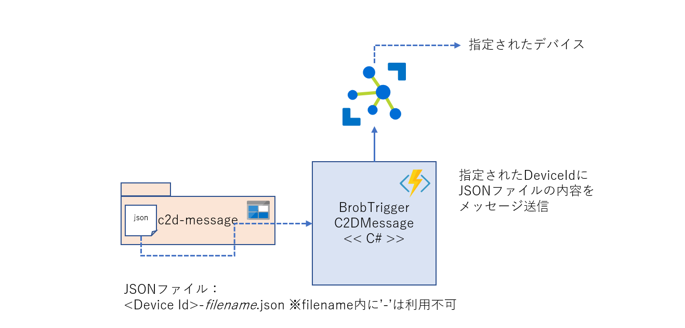

# AzureFunctionBlobTriggerIoTHubC2DMessageByCSSample 

c2d-message ブロブコンテナにJSONファイルを格納すると、中身を指定されたIoT Hubに登録されたデバイスに送信する。 
ファイル名は、'device-id'-xyz.json  
xyzの部分はファイル名として利用可能でかつ '-' 以外の英数字で、その前の '-' より前の文字列が Azure IoT Hub に登録されたDeviceIdであること。

## Azure Function の作成と Azure への配置 
1. Blob Storage の作成 
2. Azure IoT Hub の作成 
3. Azure Function の作成 
4. [この C# Project と Azure 側の Binding情報更新](doc/bindsetting.md) 
5. この C# Project の Azure Function への配置 
6. [テスト](test.md) 
